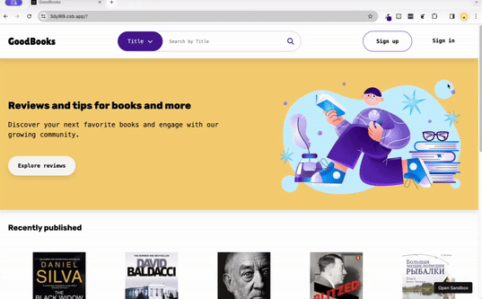

# GoodBooks

**GoodBooks** is a practical demonstration of utilizing APIs in plain HTML, CSS, and JavaScript. This is a learning exercise and not a real-world application.

### Demo

### Codesandbox

The codes also available at codesandbox [here](https://codesandbox.io/p/sandbox/assignment-2-js-async-hackhive-3dy9l9?file=%2Findex.html).